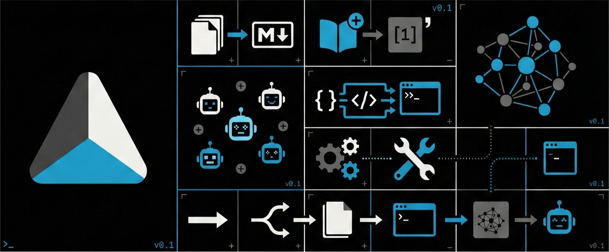

# Gnosis Toolkit

A modular collection of developer tools built by and for the [Gnosis Research Center](https://grc.iit.edu) community at Illinois Institute of Technology.

Each tool lives in its own repository under the `gnosis-*` namespace, allowing independent development, versioning, and contribution workflows.

## Tools

| Repository | Description | Status |
|------------|-------------|--------|
| gnosis-pdf2md | PDF to Markdown converter | Planned |
| gnosis-citations | Citation extraction from papers | Planned |
| gnosis-semgraph | Semantic knowledge graph builder | Planned |
| gnosis-tasks | Task and project management | Planned |
| gnosis-urlshort | URL shortener service | Planned |

## Installation

Each tool is installable independently:
```bash
pip install gnosis-pdf2md
pip install gnosis-citations
```

Tools use Python namespace packages, so they all import under `gnosis.*`:
```python
from gnosis.pdf2md import convert
from gnosis.citations import extract
```

## Contributing

1. Fork the specific tool repository to your account
2. Create a feature branch
3. Submit a pull request to the upstream repo

See [CONTRIBUTING.md](CONTRIBUTING.md) for detailed guidelines.

## License

All Gnosis Toolkit projects are licensed under [Apache 2.0](LICENSE).

---

**Gnosis Research Center** · Illinois Institute of Technology · Chicago, IL
